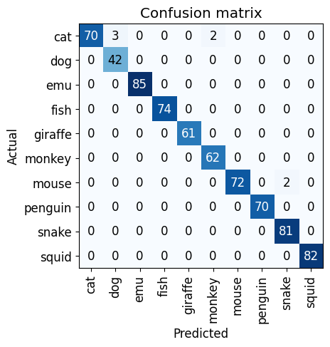

# Introduction Notes About Fast Ai

## What is it?
Fastai is a high-level deep learning library built on top of PyTorch that aims to make deep learning more accessible and easier to implement. It was developed by Jeremy Howard and Sylvain Gugger, and it has gained significant popularity among researchers, students, and practitioners in the field of artificial intelligence.

- Fastai is a practical deep learning library for real-world applications.
- It was developed for the "Deep Learning for Coders" course by Jeremy Howard and Rachel Thomas.
- Fastai v2 is a major update with a more modular and flexible design.
- Fastai v2 improved performance and added support for tabular data, NLP, and time series analysis.
- The "One-Cycle Policy" introduced by Fastai optimizes training speed and performance.
- Fastai emphasizes transfer learning, leveraging pre-trained models for specific tasks.
- The Fastai community has vibrant forums for discussions and support.

## Example Animal Classification
To train a model, we'll need ```DataLoaders```, which is an object that contains a training set (the images used to create a model) and a validation set (the images used to check the accuracy of a model -- not used during training). In ```fastai``` we can create that easily using a ```DataBlock```, and view sample images from it:
```python
searches = 'dog','cat','fish','snake','giraffe','penguin','mouse','monkey','emu', 'squid'
path = Path('selectedAnimals')
from time import sleep

for o in searches:
    dest = (path/o)
    dest.mkdir(exist_ok=True, parents=True)
    download_images(dest, urls=search_images_ddg(f'{o} animal'))
    sleep(5)  # Pause between searches to avoid over-loading server
    resize_images(path/o, max_size=400, dest=path/o)
```
Some photos might not download correctly which could cause our model training to fail, so we'll remove them:
```python
failed = verify_images(get_image_files(path))
failed.map(Path.unlink)
len(failed)
```
Now we're ready to train our model. The fastest widely used computer vision model is ```resnet18```. You can train this in a few minutes, even on a CPU! (On a GPU, it generally takes under 10 seconds...)
```fastai``` comes with a helpful ```fine_tune()``` method which automatically uses best practices for fine tuning a pre-trained model, so we'll use that.
```python
learn = vision_learner(dls, resnet18, metrics=error_rate)
learn.fine_tune(3)
```
To generate a Confusion Matrix table given the trained model.
```python
from fastai.vision.all import *

# Create the interpretation object
interp = ClassificationInterpretation.from_learner(learn)

# Generate the confusion matrix
interp.plot_confusion_matrix()
```




Given the Confusion Table as seen above for the most case most were matched correctly however there were a few outliner.
For example:
- Overlap between cats and dogs which is expected as they can be both the same size with similar shapes.
- Overlap with the snake and mouse can be related with the fact of snakes being a predator to mice. 
- Overlap with monkey and cat could be caused from the fur similatities 

To improve the output of the Matrix (ChatGPT):
- Preprocess and clean your data, including normalization, feature scaling, and handling missing values.
- Select appropriate features or perform feature engineering to capture meaningful information from the data.
- Choose the right model and tune its hyperparameters to optimize performance.
- Use cross-validation techniques to evaluate your model's performance and detect overfitting or underfitting.
- Consider ensemble methods to combine predictions from multiple models and improve accuracy.
- Handle class imbalance issues using techniques like oversampling, undersampling, or class weighting.
- Apply regularization techniques and use dropout layers to prevent overfitting.
- Explore fine-tuning and transfer learning if pre-trained models are available.
- Perform error analysis on the confusion matrix to identify patterns and areas for improvement.
- Iterate and experiment with different approaches, continually refining your model and data preprocessing techniques.

